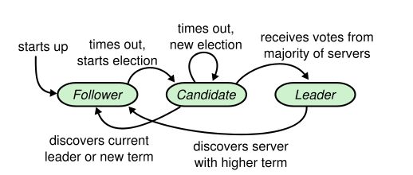
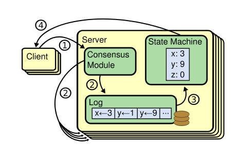
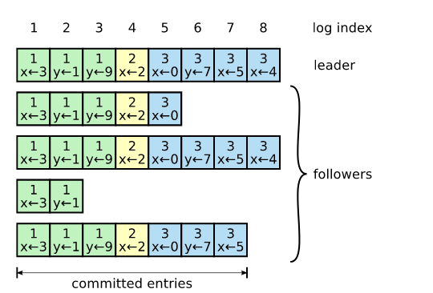

# RAFT
## Introduction
- A consensus algorithm for managing a replicatedlog.
Allow a collection of machinesto work as a coherent group that can survive the fail-ures of some of its members.
- A popular consensus algorithm which is used by MongoDB and ETCD.

## Resolve three problems
### Leader election
#### Basics
- Three states: leader, follower, or candidate
  - The leader handles all client requests (if a client contacts a follower, the follower redirects it to theleader)
  - Followers are passive: they issue no requests ontheir own but simply respond to requests from leadersand candidates.
  - Candidate, is used to elect a newleader
- Term
  - Arbitrary length
  - Each server stores acurrent termnumber, which increases monotonically over time.
### Leader election

### Log replication
#### Architecture

#### Log organization

#### Raft maintains the following properties
- If two entries in different logs have the same index and term, then they store the same command.
- If two entries in different logs have the same indexand term, then the logs are identical in all precedingentries.

#### Consistency
In Raft, the leader handles inconsistencies by forcing the followers’ logs to duplicate its own. This means that conflicting entries in follower logs will be overwritten with entries from the leader’s log. 
### Security
#### Election restriction
Raft uses the voting process to prevent a candidate from winning an election unless its log contains all committed entries.
#### Committing entries from previous terms
- Problem

  A leader knows that an entry from its current term is committed once that entry isstored on a majority of the servers. If a leader crashes before committing an entry, future leaders will attempt tofinish replicating the entry. However, a leader cannot immediately conclude that an entry from a previous term iscommitted once it is stored on a majority of servers.
- Solution

  Raft never commits log entries from previous terms by count-ing replicas.
## Reference
https://raft.github.io/raft.pdf
